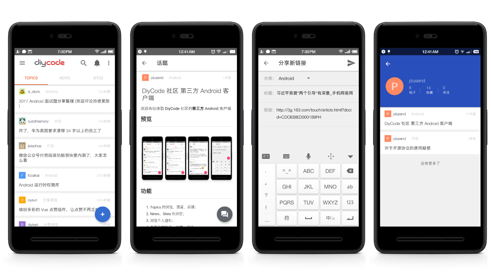

# DiyCode 社区的第三方 Android 客户端
## 动机
[深夜发布个小消息，Diycode 社区、项目、News、sites 的 API 发布了 - DiyCode](https://www.diycode.cc/topics/411)

## 开发记录

[项目结构和功能点整理](http://plusend.com/2017/02/27/Diycode/)

## 下载

## 预览

## 功能

1. Topics 的浏览、回复、新建；
2. News 的浏览、分享、新建；
3. Sites 的浏览；
4. 浏览个人通知；
5. 查看我的帖子、收藏、评论。

## 版权
采用 [GNU General Public License v3.0](https://github.com/plusend/DiyCode/blob/master/LICENSE.md)

## 鸣谢
[DiyCode - 致力于构建开发工程师高端交流分享社区](https://www.diycode.cc)
